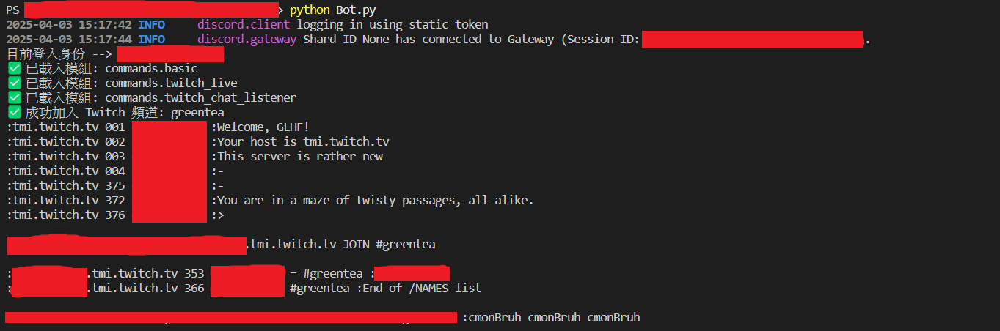
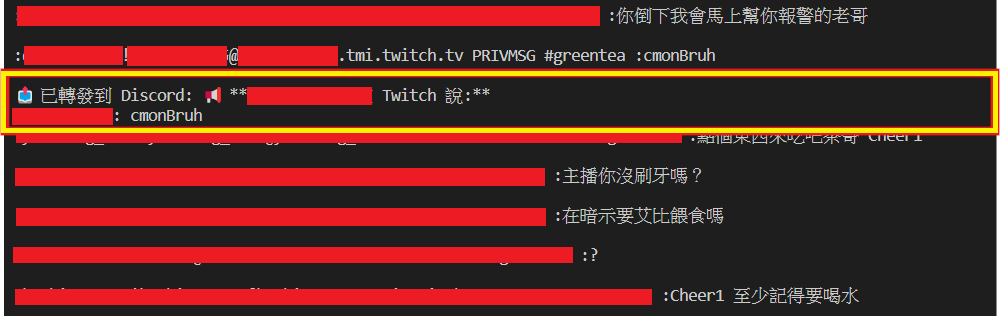
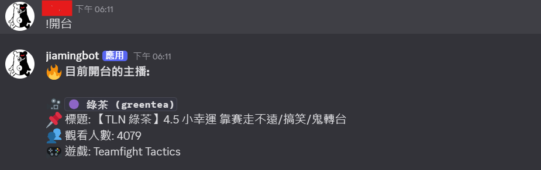

# Discord-bot

一個discord機器人

1. 可以輸入指令查看開台資訊。

2. 由於Twitch的訊息會被洗掉，可能會錯過某些訊息，這時只要把不想錯過的人加入到target_users，就可以轉傳到Discord頻道中，不會錯過任何訊息。

## Features
- 部屬到雲端

## 範例
1. 執行

    

    

2. discord輸入指令

    


## 準備工作

1.虛擬環境

    ```bash
    $ python -m venv venv
    ```

2. VSCode

    ```md
        1. Ctrl + Shift + P
        2. Python: Select Interpreter
        3. venv\Scripts\python.exe
    ```

3. 安裝套件

    ```bash
    pip install -r requirements.txt
    ```

4. 其他設定

    .env
    ```bash
    DISCORD_TOKEN = YOUR_DISCORD_TOKEN
    TWITCH_CLIENT_ID = YOUR_TWITCH_CLIENT_ID
    TWITCH_OAUTH_TOKEN = YOUR_TWITCH_OAUTH_TOKEN
    DISCORD_CHANNEL_ID = YOUR_DISCORD_CHANNEL_ID
    ```

    twitch_channels.json
    ```bash
    // "name": "id"
    {
        "Uzra": "uzra",
        "綠茶": "greentea"
    }
    ```

    twitch_config.json
    ```bash
    {
        "twitch_channel": "greentea", // 要檢查的頻道
        "target_users": ["user", "user1", "user2"] // 要追蹤的人
    }
    ```

## 開始
```bash
python Bot.py
```

## Discord指令
- !hello
- !開台
